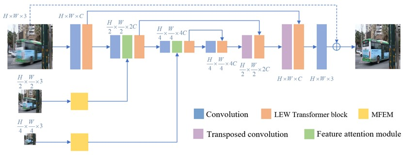

<div align="center">

<h1>Real-World Blur Dataset and Multiscale Algorithmic for Enhanced Image Deblurring</h1>

<div>
    <a href='' target='_blank'>Xunrong Li</a><sup>1</sup>&emsp;
    <a href='' target='_blank'>Dongming Zhou</a><sup>1,2</sup>&emsp;
    <a href='' target='_blank'>Kaixiang Yan</a><sup>1</sup>&emsp;

</div>
<div>
    <sup>1</sup>Yunnan University, <sup>2</sup>Hunan University of Information Technology
</div>


<strong>In this paper, we present a novel real-world blur dataset, named MTRBlur, comprising both out-of-focus and motion-blurred images captured from diverse static and dynamic scenes, respectively. This dataset addresses the limitations of existing synthetic and real blur datasets by offering a more comprehensive and realistic representation of real-world blurred images. To effectively restore these blurred images, we propose a multi-input and multi-scale encoder-decoder network, MMTNet, built upon the Transformer structure. Our approach demonstrates the necessity of utilizing real blur datasets for achieving authentic deblurring and the efficacy of our network in restoring such images. Extensive experiments across low-level and high-level computer vision tasks show that our dataset and method significantly enhance the quality of deblurring for actual blurred images. Our contributions include the introduction of the MTRBlur dataset, the proposal of the MMTNet network, and the evaluation of our low-level computer vision task using target detection methods in high-level tasks.</strong>


---

</div>

## 🤩 Package dependencies
The project is built with PyTorch 1.13.1, Python3.10, CUDA11.7. For package dependencies, you can install them by:
```bash
pip install -r requirements.txt
```

## 😎 Dataset

we present a novel real-world blur dataset, named <a href='https://github.com/Rachelfanqie/MTRBlur' target='_blank'>MTRBlur</a>.You can download it at this link.

put it under a directory, e.g., `datasets/deblurring`.

## 🥰 Method

We propose a multi-input multi-scale encoder-decoder network based on the Transformer structure, named MMTNet. The efficacy of our real blur dataset for recovering authentic blurring effects is thoroughly analyzed and validated.



## 🛠️ Usage

### Installation

- Clone our [repo](https://github.com/Rachelfanqie/MMTNet) from GitHub:
```shell
git clone https://github.com/Rachelfanqie/MMTNet.git
cd MMTNet
```

- Download [model_best.pth](https://drive.google.com/file/d/1W9lt4tqw0Y7FjhHJrm5uO9CiaxpgMv-m/view?usp=drive_link), put it under a directory, e.g., `train/logs/model_best.pth`.

## ‍💻 Training

Please refer to [options.py](options.py) for training details.

To train MMTNet , run the command below:

``` python src/train.py  ```

## 👨‍💻 Test

To test MMTNet , run the command below:

``` python src/test.py ```

Output images will be saved in ``` results/debluring``` folder.


## 🗞️ License

This project is open sourced under MIT license. See [LICENSE](./LICENSE) for more information.
